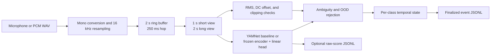
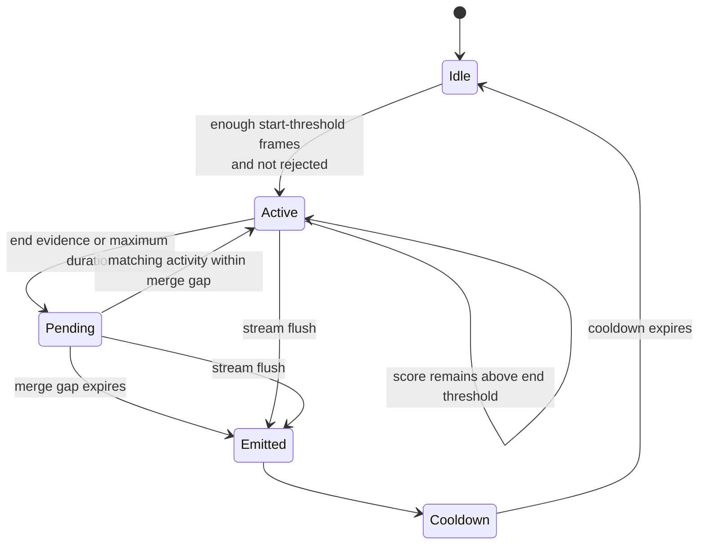

# Embodied YAMNet


[](https://github.com/taka-k22/embodied-YAMNet/actions/workflows/test.yml?query=branch%3Amain)


Embodied YAMNet is the acoustic-event perception layer for an embodied-agent research platform. It converts microphone or PCM WAV audio into conservative, time-bounded events for coughs, sneezes, laughter, alarms, and timers or ringtones.

The detector is designed for controlled research deployment rather than general-purpose audio tagging. It exposes no Kokomi Kernel, MQTT, HTTP, or WebSocket integration and makes no claim that an event occurred when confidence, signal quality, class separation, or embedding familiarity is insufficient.

## System status

| Area | Current state | Operational meaning |
| --- | --- | --- |
| YAMNet AudioSet baseline | Implemented | Maps selected AudioSet classes directly to the five target labels |
| Frozen YAMNet transfer model | Implemented | Applies a five-output linear sigmoid head to 1,024-dimensional embeddings |
| Frozen BEATs transfer model | Implemented | Applies the same head design to embeddings from an official local BEATs checkpoint |
| Temporal event decisions | Implemented | Uses per-class hysteresis, frame history, duration, cooldown, and merge rules |
| Rejection controls | Implemented | Suppresses poor-quality, ambiguous, and configured out-of-distribution frames |
| Dataset integrity | Implemented | Rejects split leakage by source, session, person, and device identifiers |
| Calibration and evaluation | Implemented | Separates training, validation-only calibration, and final test evaluation |
| Live microphone inference | Implemented | Emits finalized JSONL events and optionally records raw diagnostics or audio |
| Deployment model | Not selected | Selection requires environment-specific validation and test evidence |

## Detection contract

The label order is fixed throughout model heads, configuration, metrics, and serialized artifacts:

1. `cough`
2. `sneeze`
3. `laughter`
4. `alarm`
5. `timer_or_ringtone`

Each scorer returns five independent sigmoid-compatible scores in that order. The labels are therefore multi-label outputs, not a softmax partition. The temporal engine may track more than one class, but ambiguous frames are rejected globally when the two highest scores differ by less than the configured ambiguity margin.

`unknown` is a decision outcome rather than a sixth emitted label. Low-confidence, acoustically invalid, ambiguous, or out-of-distribution input produces no confirmed target event.

## Processing model



### Audio normalization

| Property | Contract |
| --- | --- |
| Internal sample rate | Exactly 16,000 Hz |
| Channel layout | Mono; multichannel input is averaged across channels |
| WAV input | Unsigned 8-bit, signed 16-bit, or signed 32-bit PCM |
| Hop | 250 ms by default |
| Short analysis window | 1,000 ms by default |
| Long analysis window | 2,000 ms by default |
| Startup behavior | Missing history is left-padded with zeros |
| Live buffering | A fixed-capacity ring buffer retains the current long window |

Audio quality is inspected on the long window. A frame is poor when any configured condition is true:

| Condition | Default boundary |
| --- | ---: |
| Silence | RMS below 0.0005 |
| DC offset | Absolute mean above 0.05 |
| Clipping | More than 1% of samples have absolute amplitude at least 0.999 |

Poor-quality frames cannot start an event and cannot refresh an active event's end-threshold evidence.

## Model families

| Architecture | Encoder | Classifier | Window aggregation | Intended role |
| --- | --- | --- | --- | --- |
| `yamnet_standard` | TF Hub YAMNet | Explicit AudioSet class mapping | Short view for cough and sneeze; maximum of short and long views for continuing classes | Training-free reference baseline |
| `yamnet_transfer` | Frozen TF Hub YAMNet | Five-output linear sigmoid head | Short view for cough and sneeze; maximum of short and long views for continuing classes | Primary lightweight transfer candidate |
| `beats_transfer` | Frozen official BEATs source and local checkpoint | Five-output linear sigmoid head | Same short/long policy as YAMNet transfer | Higher-capacity comparison candidate |
| `mock_transfer` | Deterministic 16-dimensional test extractor | Five-output linear sigmoid head | Same transfer-scoring path | Pipeline verification only; never model evidence |

The direct YAMNet mapping is fixed as follows:

| Target label | AudioSet display names |
| --- | --- |
| `cough` | `Cough` |
| `sneeze` | `Sneeze` |
| `laughter` | `Laughter`, `Giggle` |
| `alarm` | `Alarm`, `Smoke detector, smoke alarm`, `Fire alarm`, `Siren` |
| `timer_or_ringtone` | `Ringtone`, `Alarm clock`, `Telephone bell ringing`, `Ding-dong` |

Transfer heads store weights, bias, per-class temperature, label order, encoder identity, embedding dimension, training metadata, and normalized embedding statistics. The SHA-256 digest of the serialized head is its classifier version. BEATs source and checkpoints are not downloaded automatically; their provenance and hashes remain external inputs governed by [DATA_AND_LICENSES.md](DATA_AND_LICENSES.md).

## Temporal decision state

Every class owns independent history, active-event, pending-event, and cooldown state.



An event starts only after at least `required_frames` positive entries exist within the class history. Once active, the lower end threshold provides hysteresis. Events shorter than the minimum duration are discarded. Finalized events are held pending for the merge gap so nearby segments of the same class can become one event. The maximum duration always terminates an active segment.

### Default class policy

| Label | Start | End | Required / history | Minimum | Cooldown | Merge gap | Maximum |
| --- | ---: | ---: | ---: | ---: | ---: | ---: | ---: |
| `cough` | 0.80 | 0.45 | 1 / 2 frames | 100 ms | 1,000 ms | 400 ms | 4,000 ms |
| `sneeze` | 0.82 | 0.45 | 1 / 2 frames | 100 ms | 1,500 ms | 400 ms | 4,000 ms |
| `laughter` | 0.75 | 0.40 | 2 / 3 frames | 500 ms | 750 ms | 750 ms | 15,000 ms |
| `alarm` | 0.82 | 0.50 | 3 / 5 frames | 750 ms | 1,000 ms | 1,000 ms | 30,000 ms |
| `timer_or_ringtone` | 0.82 | 0.48 | 3 / 4 frames | 750 ms | 1,000 ms | 1,000 ms | 20,000 ms |

The defaults are initialization values, not deployment claims. `configs/yamnet_baseline_live.json` is a permissive diagnostic profile for early data collection and is not an accepted production calibration.

## Rejection policy

A frame is globally suppressed when at least one of the following conditions holds:

- the long audio window fails a quality check;
- the gap between the two highest class scores is below `ambiguity_margin`, which defaults to 0.08;
- a transfer embedding's normalized root-mean-square distance exceeds a configured `ood_max_distance`.

Transfer-model OOD distance is computed from the long-window embedding against training-set mean and standard-deviation vectors. Calibration sets the boundary to the 99.5th percentile of validation distances when compatible training statistics are available. The direct YAMNet baseline does not produce an embedding-distance signal.

## Dataset contract

The authoritative dataset interface is one JSON object per line. [`schemas/manifest.schema.json`](schemas/manifest.schema.json) defines the serialized shape.

| Field | Requirement | Meaning |
| --- | --- | --- |
| `path` | Required | Absolute path or path relative to the manifest |
| `split` | Required | Exactly `train`, `validation`, or `test` |
| `labels` | Required | Unique subset of the five target labels; an empty array is a negative clip |
| `source_id` | Required | Stable originating-audio identity |
| `session_id` | Required | Stable recording-session identity |
| `person_id` | Conditional | Identity grouping when a person can be distinguished |
| `device_id` | Conditional | Identity grouping when a capture device can be distinguished |
| `recorded_at` | Optional | Recording timestamp |
| `is_hard_negative` | Optional | Marks negative material eligible for training-time background mixing |
| `playback` | Optional | Distinguishes replayed target audio from naturally produced events |
| `events` | Optional | Continuous annotations containing `label`, `start_ms`, and `end_ms` |

`source_id`, `session_id`, and every populated `person_id` and `device_id` must belong to exactly one split. Dataset preparation fails if any identity crosses a split. Prepared indexes resolve paths, verify file presence, record SHA-256 hashes, and preserve split, label, playback, hard-negative, and event metadata.

The test split is evaluation-only. It must never determine augmentation, weights, temperature, score thresholds, OOD boundaries, or temporal parameters. It may be used for final comparison and model selection only after every candidate and decision rule has been frozen.

## Learning and calibration contract

Transfer training freezes the encoder and optimizes only a five-output linear head with deterministic seed 17, class-prevalence weighting, and L2 regularization. Recordings are divided into non-overlapping two-second clips, with zero-padding only when a recording is shorter than one window.

Configured waveform augmentation applies only to the training split. Supported transformations are bounded gain, time shift, time stretch, hard-negative background mixing, room impulse response convolution, and waveform masking. Background and impulse-response material must follow the same split-integrity policy as primary recordings.

Calibration reads only the validation split and performs, in order:

1. per-class temperature selection for transfer heads by binary cross-entropy over a fixed geometric grid;
2. per-class threshold search for every model over 201 points from 0.0 through 1.0, prioritizing maximum recall at precision of at least 0.95;
3. validation-only temporal grid search over start threshold, end ratio, required frames, and cooldown;
4. transfer-model OOD boundary estimation when training embedding statistics are available.

Temporal tuning treats 0.1 false positives per hour per class on negative validation audio as its feasibility budget. If no candidate meets that budget, the best available candidate is retained and explicitly marked as noncompliant.

## Event output contract

Only finalized events are written to the event log. [`schemas/event.schema.json`](schemas/event.schema.json) defines the serialized form:

```json
{
  "schema_version": "1.0",
  "event_id": "evt_<uuid>",
  "label": "cough",
  "confidence": 0.94,
  "started_at": "2026-01-01T00:00:00.000Z",
  "ended_at": "2026-01-01T00:00:00.500Z",
  "duration_ms": 500,
  "source": "microphone",
  "model": {
    "architecture": "yamnet_transfer",
    "checkpoint": "yamnet/1",
    "classifier_version": "<sha256>"
  },
  "decision": {
    "start_threshold": 0.8,
    "peak_score": 0.94,
    "frames_above_threshold": 2
  }
}
```

Timestamps are UTC ISO 8601 values with millisecond precision. Confidence is the peak class score observed during the event. Event logs are append-only JSONL. Optional raw logs contain timestamped scores, decision status, and audio-quality diagnostics for every processed hop.

Live audio is not retained unless recording is explicitly enabled. Event and raw-score output remain local; this repository contains no network transport.

## Evaluation contract

Clip evaluation reduces each recording to the maximum score observed for each class and records:

- per-class precision, recall, F1, TP, FP, FN, and TN;
- macro F1 and macro recall;
- per-class precision–recall points;
- a five-class-plus-unknown confusion matrix;
- explicit false-positive and false-negative records;
- real-time factor, peak traced Python memory, and model size when known.

Continuous evaluation runs the full temporal engine. A detection matches at most one truth event with the same recording and label when their intervals overlap within a 500 ms tolerance. It reports matched events, misses, false detections, false positives on fully negative audio, negative-audio hours, false positives per hour, detection latency, and mean real-time factor.

### Model-selection gate

A report may select a model only when:

- every class has precision of at least 0.95; and
- total false positives on negative continuous audio are at most 0.5 per hour.

Among compliant models, the model with the highest macro recall is selected. The report also exposes the broader research targets of per-class recall at least 0.80, macro F1 at least 0.87, and p95 latency at most 1,500 ms. If no model passes the selection gate, the selected model is `null`. Mock-extractor metrics are pipeline checks and do not constitute deployment evidence.

## Command surface

The `sound-detector` interface defines seven pipeline operations:

| Operation | Contract |
| --- | --- |
| `prepare-dataset` | Validate split integrity and create a hashed prepared index |
| `train` | Fit a deterministic linear head on frozen embeddings from the training split |
| `calibrate` | Fit validation-only temperatures, thresholds, temporal rules, and optional OOD boundary |
| `evaluate` | Produce clip-level test artifacts and resource measurements |
| `evaluate-continuous` | Produce event-level, latency, and negative-audio false-positive measurements |
| `live` | Process microphone input and append finalized local events |
| `export-report` | Compare evaluated model runs and apply the model-selection gate |

## Repository boundaries

| Path | Responsibility |
| --- | --- |
| `src/daily_sound_detector/` | Audio normalization, model adapters, training, calibration, temporal decisions, evaluation, reporting, and live capture |
| `configs/` | Default detector, diagnostic baseline, and augmentation policies |
| `schemas/` | Manifest and event JSON Schema contracts |
| `scripts/` | Public-dataset preparation, manifest combination, BEATs verification, embedding caching, and cached-head training |
| `provenance/` | Source and artifact provenance records |
| `tests/` | Deterministic mock-based regression specifications |
| `yamnet-archives/` | Historical notebooks and superseded environment notes |

Runtime recordings, model weights, downloaded datasets, reports, caches, and generated artifacts are excluded from source control. Dataset and model licensing obligations are documented separately in [DATA_AND_LICENSES.md](DATA_AND_LICENSES.md).

## Safety invariants

1. Unknown labels, invalid split names, malformed class configurations, and incompatible head shapes are rejected.
2. Training refuses any detected source, session, person, or device leakage across splits.
3. Calibration and temporal tuning use validation data only; test data remains evaluation-only.
4. Poor-quality, ambiguous, and configured OOD frames cannot start events.
5. Event completion requires temporal evidence; a raw score crossing is never itself a finalized event.
6. Model identity and classifier version accompany every finalized event.
7. BEATs code and checkpoints must be local, explicit, and provenance-recorded.
8. Live audio is never recorded by default.
9. No external service receives audio, scores, or events from this implementation.
10. No model is selected when the deployment gate is unmet or unmeasured.

## Verification contract

Continuous integration performs static verification only. On Windows and Linux with Python 3.11 it checks Python lint and syntax for the package, scripts, and regression specifications. Model downloads, microphone access, training, calibration, and regression execution are deliberately outside the CI contract.

## License

The repository is licensed under the [MIT License](LICENSE).
